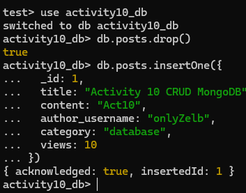
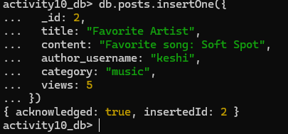
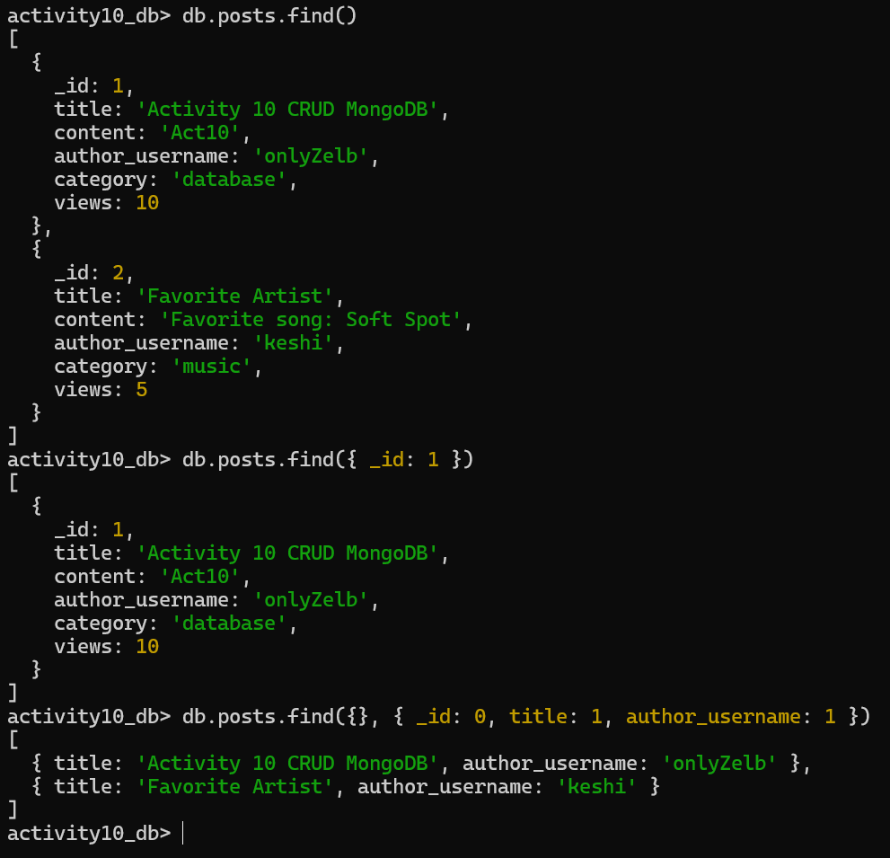
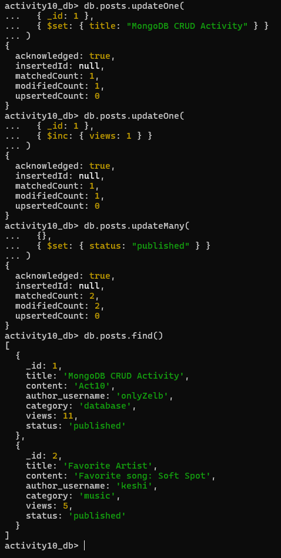
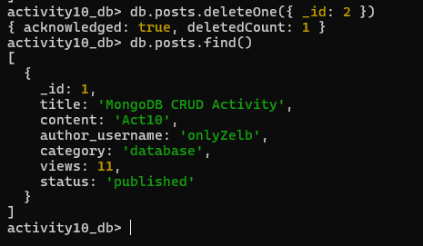

# Activity 10 Solution


## Part 1: Quick Mapping (Postgres -> MongoDB)

| PostgreSQL | MongoDB Equivalent |
|---|---|
| `INSERT INTO posts ...` |`db.posts.insertOne({...})` |
| `SELECT * FROM posts WHERE title='...'` |`db.posts.find({ title: "..." })` |
| `UPDATE posts SET title='...' WHERE id=...` |`db.posts.updateOne({ _id: ... }, { $set: { title: "..." } })` |
| `DELETE FROM posts WHERE id=...` | `db.posts.deleteOne({ _id: ... })` |

## Part 2: Hands-on CRUD in MongoDB

Write the commands you executed and paste screenshots from Mongo shell after each command/block.

### 2.1 Setup

Commands:

```javascript
use activity10_db
db.posts.drop()

db.posts.insertOne({
  _id: 1,
  title: "Activity 10 CRUD MongoDB",
  content: "Act10",
  author_username: "onlyZelb",
  category: "database",
  views: 10
})
```

Screenshot(s):
- 


### 2.2 Create

Commands:

```javascript
db.posts.insertOne({
  _id: 2,
  title: "Favorite Artist",
  content: "Favorite song: Soft Spot",
  author_username: "keshi",
  category: "music",
  views: 5
})
```

Screenshot(s):
- 

### 2.3 Read

Commands:

```javascript
// 1. Find all posts
db.posts.find()

// 2. Find post with _id: 1
db.posts.find({ _id: 1 })

// 3. Show only title and author_username (exclude _id)
db.posts.find({}, { _id: 0, title: 1, author_username: 1 })
```

Screenshot(s):
- 

### 2.4 Update

Commands:

```javascript
// 1. Change title of _id: 1
db.posts.updateOne(
  { _id: 1 },
  { $set: { title: "MongoDB CRUD Activity" } }
)

// 2. Increase views by 1
db.posts.updateOne(
  { _id: 1 },
  { $inc: { views: 1 } }
)

// 3. Add status to all posts
db.posts.updateMany(
  {},
  { $set: { status: "published" } }
)
```

Screenshot(s):
- 

### 2.5 Delete

Commands:

```javascript
db.posts.deleteOne({ _id: 2 })
```

Screenshot(s):
- 

## Part 3: Reflection (3-4 sentences)

1. One thing that feels easier in MongoDB CRUD:

- MongoDB CRUD feels easier because I can add or change fields without modifying a table structure. This makes it flexible when the data changes often. The commands are short and simple to write in the Mongo shell. Using operators like `$set` and `$inc` makes updates quick and convenient.

2. One thing that was clearer in PostgreSQL CRUD:
- PostgreSQL CRUD was clearer because the table structure keeps the data organized. The schema helps prevent mistakes and keeps the data consistent. SQL syntax is also very readable and easy to understand. It is easier to visualize rows and columns when querying data.