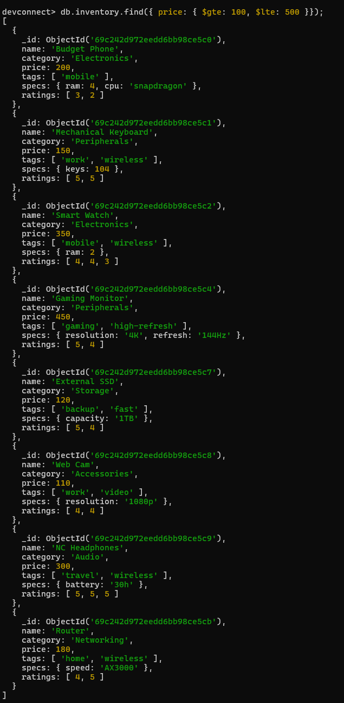
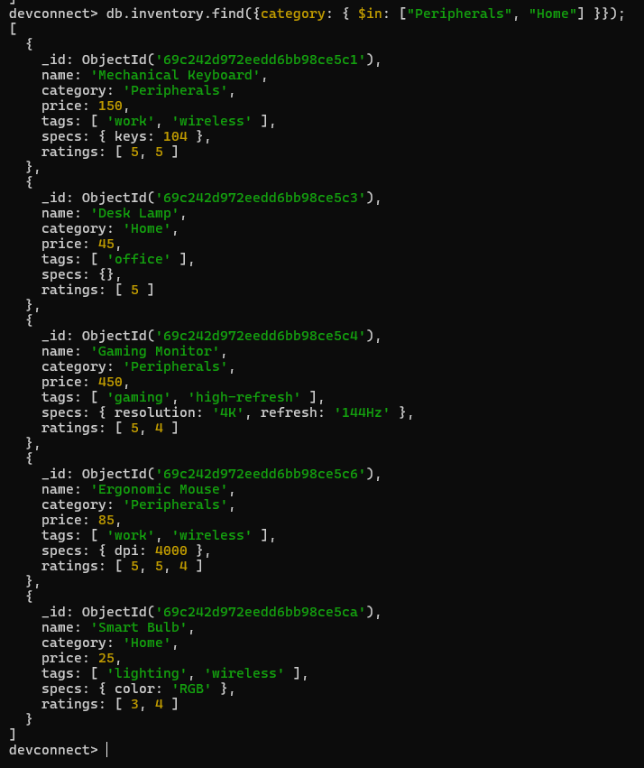
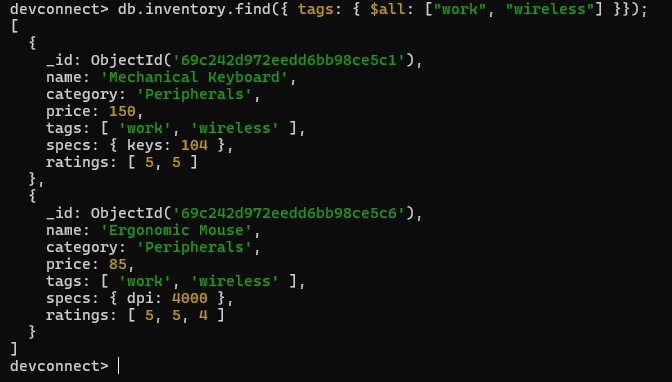
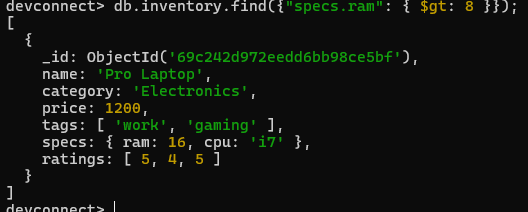
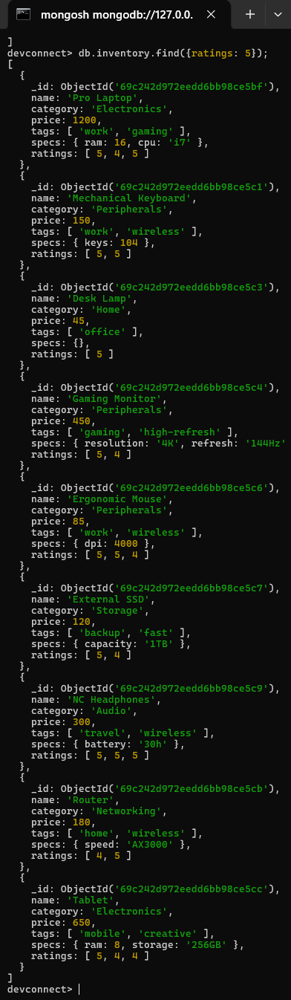

## Part 1: Relational to Document Modeling

### 1. Proposed JSON Schema

```json
{
  "_id": ObjectId("64b1f2e3c9a1234567890abc"),
  "title": "Getting Started with NoSQL Databases",
  "body": "NoSQL databases like MongoDB offer flexible schema design that fits modern applications...",
  "created_at": "2025-07-01T10:30:00Z",
  "author": {
    "user_id": ObjectId("64b1f2e3c9a1234567890001"),
    "username": "ghetto_priest",
    "email": "ghetto_priest@devconnect.io"
  },
  "tags": [
    "nosql",
    "mongodb",
    "beginner"
  ]
}
```

---

### 2. Strategic Choices

- **Tags:** **Embed**
- **Author:** **Embed (Partial Reference)**

---

### 3. Justification

**Tags** are embedded as a simple string array because they are short, read-only labels with no independent lifecycle — they are always accessed alongside the post and never updated on their own. Embedding eliminates the need for a junction collection like `post_tags` and allows efficient querying using `$all` or `$in` without additional lookups.

**Author** fields (`username`, `email`) are partially embedded so that every post can be rendered in a single document read without a separate query to the `users` collection. The `user_id` reference is retained to allow fetching the full user profile when needed (e.g., on a profile page), keeping the document size lean while still supporting relational access patterns.

Overall, these choices follow the MongoDB principle of **"store what you query together"** — since posts, their tags, and author display names are almost always fetched at the same time, embedding them maximizes read performance and reduces query complexity.

---

## Part 2: Querying with MQL Operators

### 1. Price Range
*Find all items priced between $100 and $500 (inclusive).*



```javascript
db.inventory.find({price: { $gte: 100, $lte: 500 }});
```

---

### 2. Category Match
*Find all items that are in either the "Peripherals" or "Home" categories.*


```javascript
db.inventory.find({category: { $in: ["Peripherals", "Home"] }});
```
---

### 3. Tag Power
*Find all items that have **both** the "work" AND "wireless" tags.*


```javascript
db.inventory.find({ tags: { $all: ["work", "wireless"] }});
```
---

### 4. Nested Check
*Find all items where the `specs.ram` is greater than 8GB.*


```javascript
db.inventory.find({"specs.ram": { $gt: 8 }});
```

**Expected Results:** Pro Laptop (RAM: 16)

---

### 5. High Ratings
*Find all items that have at least one `5` in their `ratings` array.*

```javascript
db.inventory.find({ratings: 5});
```


