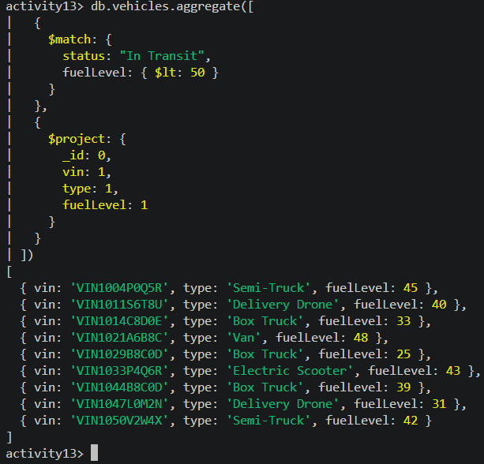
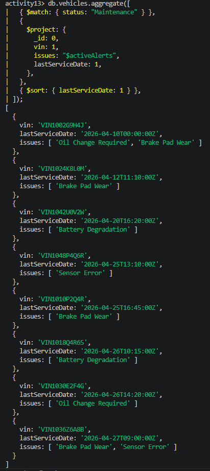
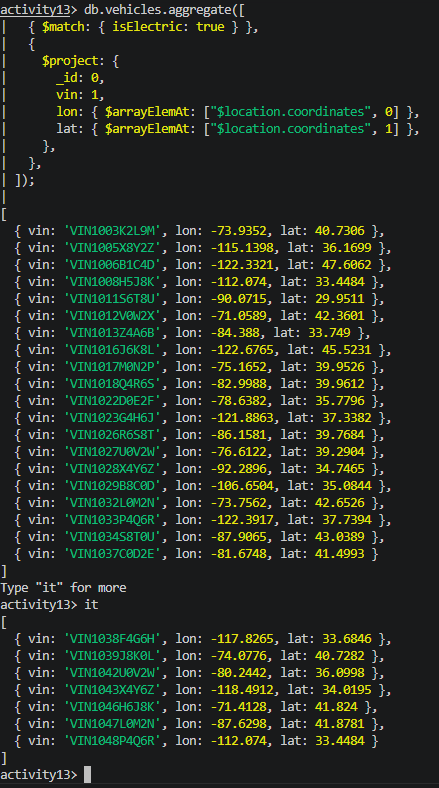
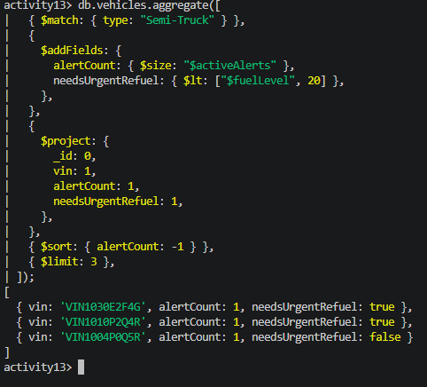

# Task 1: Emergency Fuel Report

`` The Operations Team needs a list of all vehicles (regardless of type) that are currently "In Transit" and have a fuelLevel below 50%.  ``

---

# Task 2: Maintenance Prioritization

`` Identify vehicles that are in "Maintenance".``

---
# Task 3: Electric Fleet Geo-Audit

`` The manager wants to check the location of all Electric vehicles. ``

---
# Task 4: The Mastery Challenge (Multi-Stage Complexity)

---