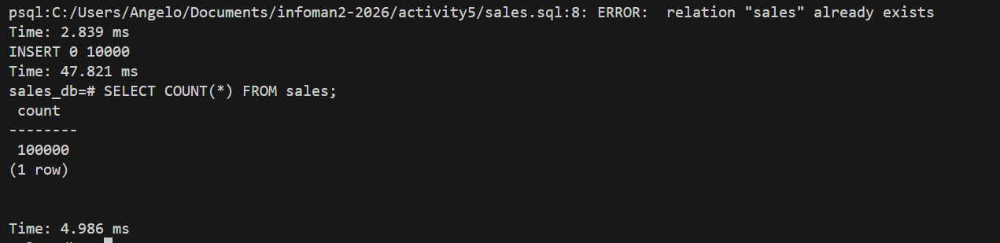
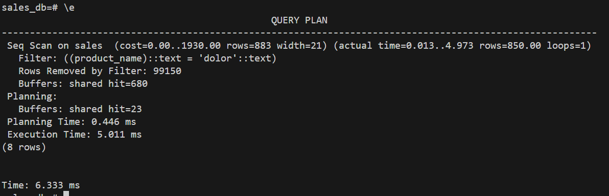
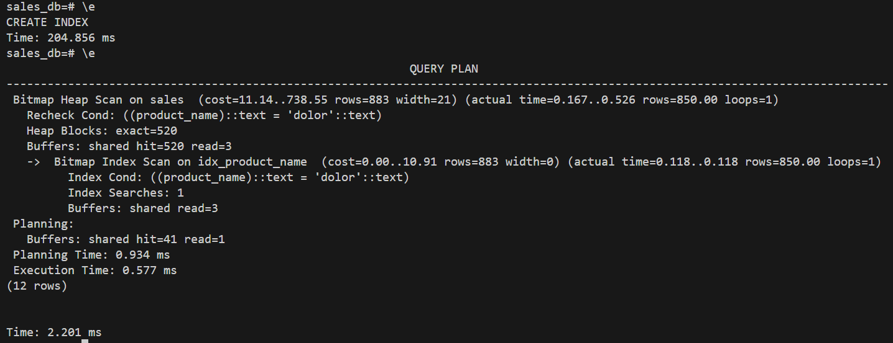
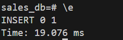

# Part 1: Data Generation and Initial Insertion



# Part 2: Querying Without an Index

```sql
EXPLAIN ANALYZE SELECT * FROM sales WHERE product_name = 'dolor';
```



# Part 3: Creating an Index and Querying

```sql
--Creating a index
CREATE INDEX idx_product_name ON sales(product_name);
```

```sql
EXPLAIN ANALYZE SELECT * FROM sales WHERE product_name = 'dolor';
```



# Part 4

```sql
--Inserting a single row
INSERT INTO sales VALUES ('test_product', 5, 50.00, '2024-01-01');
```



# Analysis Questions
```text
Recorded measurements: 

Initial Data Insertion Time (100,000 rows): Time: 47.821 ms

Query Execution Time (Non-Indexed): Execution Time: 5.011 ms

Query Execution Time (Indexed): Execution Time: 0.577 ms

Single Row Insertion Time (With Index): Time: 19.075 ms
```

```text
1. How did the query execution time change after creating the index? Was it faster or slower? By approximately how much?
    - The query became much faster after creating the index.Without the index, it took 5.011 ms. And with the index, it took 0.577 ms. It improved by about 4.4 ms.

2. Why do you think the query performance changed as you observed?
    - Without the index, the PostgreSQL can still scanned all 100,000 rows. But with the index, it quickly found the matching rows.

That is why the query became faster.
3. What is the trade-off of having an index on a table? (Hint: Compare the initial bulk insertion time with the single row insertion time after the index was created).
    - Indexes make SELECT queries faster.However, they make INSERT operations slightly slower because the index must also be updated.So, indexes improve reading data but add extra work when writing data.
```
