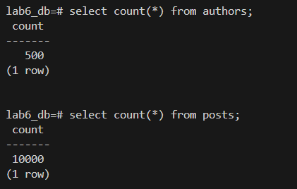

# OUTPUT


# Scenario 1
**QUERY PLAN**
```sql
EXPLAIN ANALYZE
SELECT id, title
FROM posts
WHERE author_id = 10
ORDER BY date DESC;
```
**Before:**
```sql
                                             QUERY PLAN
-----------------------------------------------------------------------------------------------------------------------------------------
 Sort  (cost=635.38..635.42 rows=18 width=56) (actual time=1.620..1.622 rows=22.00 loops=1)
   Sort Key: date DESC
   Sort Method: quicksort  Memory: 26kB
   Buffers: shared hit=513
   ->  Seq Scan on posts  (cost=0.00..635.00 rows=18 width=56) (actual time=0.026..1.589 rows=22.00 loops=1)
         Filter: (author_id = 10)
         Rows Removed by Filter: 9978
         Buffers: shared hit=510
 Planning:
   Buffers: shared hit=60 dirtied=4
 Planning Time: 0.274 ms
 Execution Time: 1.642 ms
```
**After:**
```sql
                                             QUERY PLAN
-----------------------------------------------------------------------------------------------------------------------------------------
 Sort  (cost=66.88..66.92 rows=18 width=56) (actual time=0.116..0.117 rows=22.00 loops=1)
   Sort Key: date DESC
   Sort Method: quicksort  Memory: 26kB
   Buffers: shared hit=25 read=2
   ->  Bitmap Heap Scan on posts  (cost=4.42..66.50 rows=18 width=56) (actual time=0.078..0.101 rows=22.00 loops=1)
         Recheck Cond: (author_id = 10)
         Heap Blocks: exact=22
         Buffers: shared hit=25 read=2
         ->  Bitmap Index Scan on idx_posts_author_date  (cost=0.00..4.42 rows=18 width=0) (actual time=0.061..0.061 rows=22.00 loops=1)
               Index Cond: (author_id = 10)
               Index Searches: 1
               Buffers: shared hit=3 read=2
 Planning:
   Buffers: shared hit=18 read=1
 Planning Time: 0.819 ms
 Execution Time: 0.136 ms
(16 rows)
```
---
# Scenario 2

```sql
EXPLAIN ANALYZE
SELECT id, title
FROM posts
WHERE author_id = 10
ORDER BY date DESC;
```
**Before:**
```sql

                                             QUERY PLAN
-----------------------------------------------------------------------------------------------------------------------------------------
 Seq Scan on posts  (cost=0.00..635.00 rows=1 width=52) (actual time=2.564..2.564 rows=0.00 loops=1)
   Filter: ((title)::text ~~ '%database%'::text)
   Rows Removed by Filter: 10000
   Buffers: shared hit=510
 Planning:
   Buffers: shared hit=18 read=1
 Planning Time: 0.840 ms
 Execution Time: 2.575 ms
(8 rows)
```
**After:**
```sql
                                             QUERY PLAN
-----------------------------------------------------------------------------------------------------
 Seq Scan on posts  (cost=0.00..635.00 rows=1 width=52) (actual time=1.741..1.741 rows=0.00 loops=1)
   Filter: ((title)::text ~~ 'database%'::text)
   Rows Removed by Filter: 10000
   Buffers: shared hit=510
 Planning Time: 0.082 ms
 Execution Time: 1.752 ms
(6 rows)
```
---
# Scenario 3
```sql
EXPLAIN ANALYZE
SELECT *
FROM posts
WHERE date >= '2015-01-01'
  AND date < '2015-02-01';
```
**Before:**
```sql
                                              QUERY PLAN
-------------------------------------------------------------------------------------------------------
 Seq Scan on posts  (cost=0.00..710.00 rows=1 width=374) (actual time=0.339..3.276 rows=22.00 loops=1)
   Filter: ((EXTRACT(year FROM date) = '2015'::numeric) AND (EXTRACT(month FROM date) = '1'::numeric))
   Rows Removed by Filter: 9978
   Buffers: shared hit=510
 Planning:
   Buffers: shared hit=122 read=1
 Planning Time: 2.878 ms
 Execution Time: 3.306 ms
(8 rows)
```
**After:**
```sql
                                                         QUERY PLAN
----------------------------------------------------------------------------------------------------------------------------
 Bitmap Heap Scan on posts  (cost=4.45..60.19 rows=16 width=374) (actual time=0.066..0.083 rows=22.00 loops=1)
   Recheck Cond: ((date >= '2015-01-01'::date) AND (date < '2015-02-01'::date))
   Heap Blocks: exact=22
   Buffers: shared hit=22 read=2
   ->  Bitmap Index Scan on idx_posts_date  (cost=0.00..4.45 rows=16 width=0) (actual time=0.051..0.051 rows=22.00 loops=1)
         Index Cond: ((date >= '2015-01-01'::date) AND (date < '2015-02-01'::date))
         Index Searches: 1
         Buffers: shared read=2
 Planning:
   Buffers: shared hit=15
 Planning Time: 0.164 ms
 Execution Time: 0.098 ms
```
