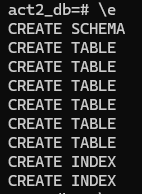
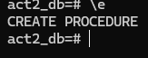
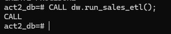
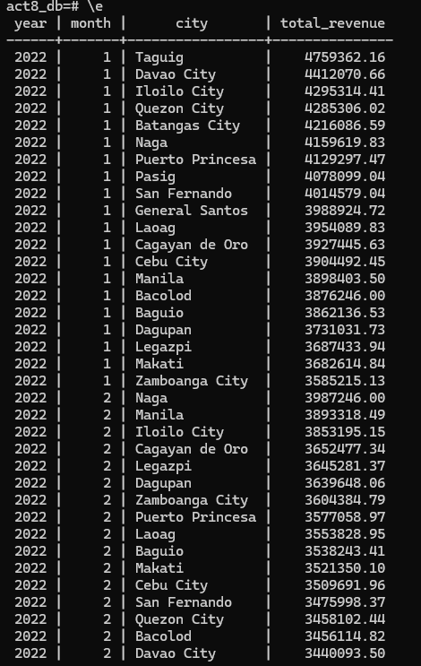
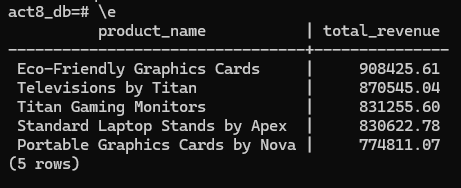
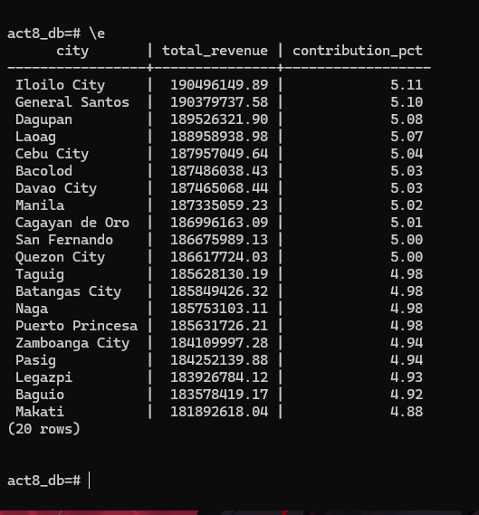

# Activity 8 

## Part 1: Star Schema Design

### 1. Fact Table Grain
- Each row in the fact table represents a product purchased by a customer in a specific order, i.e., the grain is “one row per product per order”.

### 2. Fact Measures

- `Quantity` (from `OrderItems`)
- `Revenue` (calculated as `Quantity * Product Price`)
- `Discount` (if applicable, currently none in your schema)

### 3. Dimension Tables and Attributes

- `dim_date`: `date_key`, `order_date`, `year`, `month`, `day`, `quarter`
- `dim_customer`: `customer_id`, `name`, `age`, `city`
- `dim_product`: `product_id`, `product_name`, `category_id`, `category_name`, `price`
- `dim_category`: `category_id`, `category_name`

### 4. Relationship Summary

- `fact_order_items` → `dim_date` via `order_date`
- `fact_order_items` → `dim_customer` via `user_id`
- `fact_order_items` → `dim_product` via `product_id`
- `dim_product` → `dim_category` via `category_id`


<Describe FK links from fact to dimensions>

## Part 2: Warehouse DDL

```sql
CREATE SCHEMA IF NOT EXISTS dw;

-- dim_date
CREATE TABLE dw.dim_date (
    date_key INT PRIMARY KEY,
    order_date DATE,
    year INT,
    quarter INT,
    month INT,
    day INT
);

-- dim_customer
CREATE TABLE dw.dim_customer (
    customer_id INT PRIMARY KEY,
    name VARCHAR(100),
    age INT,
    city VARCHAR(100)
);

-- dim_category
CREATE TABLE dw.dim_category (
    category_id INT PRIMARY KEY,
    category_name VARCHAR(100)
);

-- dim_product
CREATE TABLE dw.dim_product (
    product_id INT PRIMARY KEY,
    product_name VARCHAR(100),
    category_id INT,
    price DECIMAL(10,2),
    FOREIGN KEY (category_id) REFERENCES dw.dim_category(category_id)
);

-- fact_order_items
CREATE TABLE dw.fact_order_items (
    item_id BIGINT PRIMARY KEY,
    order_id INT,
    customer_id INT,
    product_id INT,
    date_key INT,
    quantity INT,
    revenue DECIMAL(12,2),
    FOREIGN KEY (customer_id) REFERENCES dw.dim_customer(customer_id),
    FOREIGN KEY (product_id) REFERENCES dw.dim_product(product_id),
    FOREIGN KEY (date_key) REFERENCES dw.dim_date(date_key)
);
```


## Part 3: ETL Procedure

### 1. Procedure Code

```sql
CREATE OR REPLACE PROCEDURE dw.run_sales_etl()
LANGUAGE plpgsql
AS $$
BEGIN
    -- Clear fact table to avoid duplicates
    TRUNCATE TABLE dw.fact_order_items;

    -- Load dim_date
    INSERT INTO dw.dim_date (date_key, order_date, year, quarter, month, day)
    SELECT
        EXTRACT(YEAR FROM OrderDate)::INT * 10000 +
        EXTRACT(MONTH FROM OrderDate)::INT * 100 +
        EXTRACT(DAY FROM OrderDate)::INT AS date_key,
        OrderDate,
        EXTRACT(YEAR FROM OrderDate)::INT,
        EXTRACT(QUARTER FROM OrderDate)::INT,
        EXTRACT(MONTH FROM OrderDate)::INT,
        EXTRACT(DAY FROM OrderDate)::INT
    FROM Orders
    ON CONFLICT (date_key) DO NOTHING;

    -- Load dim_customer
    INSERT INTO dw.dim_customer (customer_id, name, age, city)
    SELECT UserID, Name, Age, City
    FROM Users
    ON CONFLICT (customer_id) DO NOTHING;

    -- Load dim_category
    INSERT INTO dw.dim_category (category_id, category_name)
    SELECT CategoryID, CategoryName
    FROM Categories
    ON CONFLICT (category_id) DO NOTHING;

    -- Load dim_product
    INSERT INTO dw.dim_product (product_id, product_name, category_id, price)
    SELECT ProductID, ProductName, CategoryID, Price
    FROM Products
    ON CONFLICT (product_id) DO NOTHING;

    -- Load fact_order_items
    INSERT INTO dw.fact_order_items (item_id, order_id, customer_id, product_id, date_key, quantity, revenue)
    SELECT 
        oi.ItemID,
        o.OrderID,
        o.UserID,
        oi.ProductID,
        EXTRACT(YEAR FROM o.OrderDate)::INT * 10000 +
        EXTRACT(MONTH FROM o.OrderDate)::INT * 100 +
        EXTRACT(DAY FROM o.OrderDate)::INT AS date_key,
        oi.Quantity,
        oi.Quantity * p.Price AS revenue
    FROM OrderItems oi
    JOIN Orders o ON oi.OrderID = o.OrderID
    JOIN Products p ON oi.ProductID = p.ProductID;
END;
$$;
```

### 2. Procedure Execution

```sql
CALL dw.run_sales_etl();
```

### 3. ETL Log Output

```sql
SELECT * FROM dw.etl_log ORDER BY run_ts DESC;
```

```txt
act2_db=# SELECT * FROM dw.etl_log ORDER BY run_ts DESC;
           run_ts           | status  | records_loaded
----------------------------+---------+----------------
 2026-03-28 23:27:01.346024 | SUCCESS |        1000000
(1 row)
```
## Part 4: Analytical Queries

### Query 1: Monthly Revenue by Branch Region

```sql
SELECT d.year, d.month, c.city, SUM(f.revenue) AS total_revenue
FROM dw.fact_order_items f
JOIN dw.dim_date d ON f.date_key = d.date_key
JOIN dw.dim_customer c ON f.customer_id = c.customer_id
GROUP BY d.year, d.month, c.city
ORDER BY d.year, d.month, total_revenue DESC;
```

Interpretation:

This shows which cities generate the most revenue each month, helping identify top-performing regions and seasonal trends.


### Query 2: Top 5 Products by Total Revenue

```sql
SELECT p.product_name, SUM(f.revenue) AS total_revenue
FROM dw.fact_order_items f
JOIN dw.dim_product p ON f.product_id = p.product_id
GROUP BY p.product_name
ORDER BY total_revenue DESC
LIMIT 5;
```

Interpretation:

These are the products generating the highest revenue, which is useful for inventory planning and marketing focus.


### Query 3: Customer Region Contribution to Sales

```sql
SELECT c.city, SUM(f.revenue) AS total_revenue,
       ROUND(SUM(f.revenue) * 100.0 / SUM(SUM(f.revenue)) OVER (), 2) AS contribution_pct
FROM dw.fact_order_items f
JOIN dw.dim_customer c ON f.customer_id = c.customer_id
GROUP BY c.city
ORDER BY contribution_pct DESC;
```

Interpretation:

Shows the percentage of total sales contributed by each city, helping prioritize key markets.


